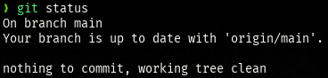

# Atividade de Laboratório 2

* **Aluno:** Leonardo Luz
* **Cadeira:** Sistema de Gerência de Configuração
* [**Repositório**](https://github.com/Leonardo-Luz/scm-exercises)
* **Pasta:** `~/scm-exercises/exercise-3/`

## Resolução

1) Definindo seu novo repositório de artefatos (via Shell):

```sh

    mkdir blank_repo2
    cd blank_repo2

    # Git init não foi necessário pois o projeto já estava inicializado

```

2) Realize o processo de CHECK-IN (primeiro commit)


3) Faça uma alteração no arquivo para disparar no git o processo de "Check-out":


4) Criar uma conta de usuário no repositório GITHUB.com (use um navegador web):

* Já possuo uma conta
* Já havia conectado o repositório a uma base remota


5) Realize o procedimento de CHECK-OUT do arquivo leiame.txt utilizando diretamente o GITHUB, após sincronize com seu repositório local:





6) Realize uma simulação de desenvolvimento simultâneo com o colega!

> Atividade realizada com Diego Prestes
> Execução dos comandos mostrado em aula
> Não foi efetuado a captura de tela desses comandos durante a aula por isso eu os refiz


