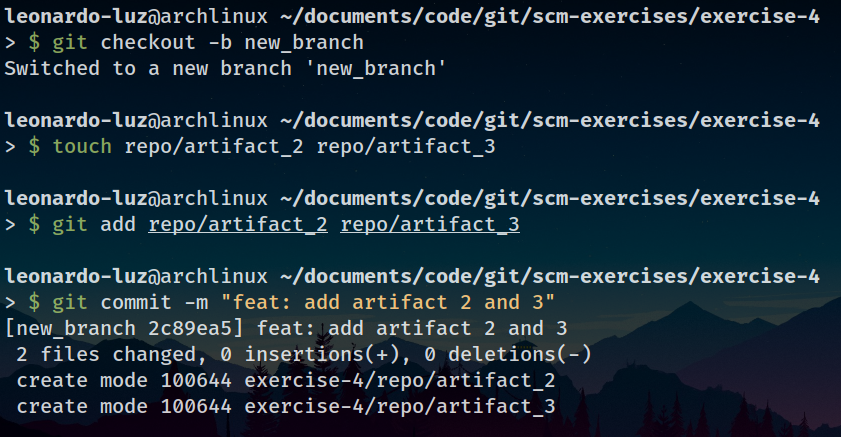
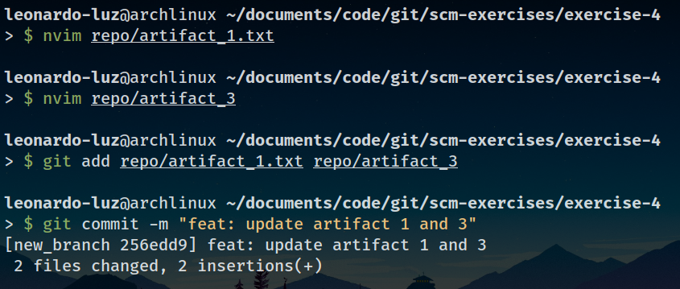
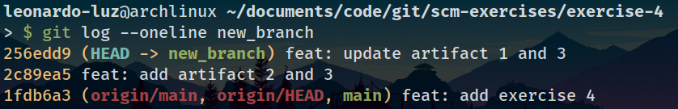
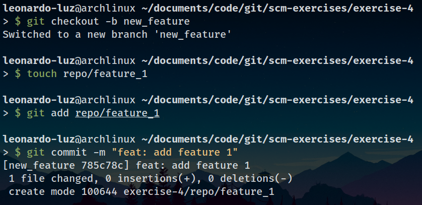
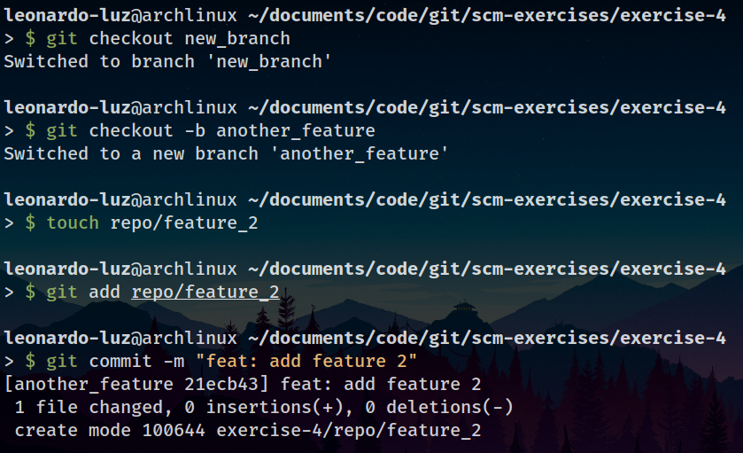
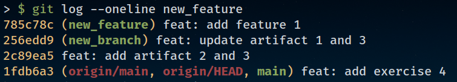
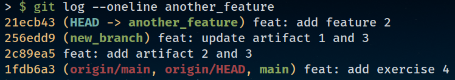

# Atividade de Laboratório 3

* **Aluno:** Leonardo Luz
* **Cadeira:** Sistema de Gerência de Configuração
* [**Repositório**](https://github.com/Leonardo-Luz/scm-exercises)
* **Pasta:** `~/scm-exercises/exercise-4/`

## Resolução

1) Uso de Branches

2) Uso de Múltiplos Branches

